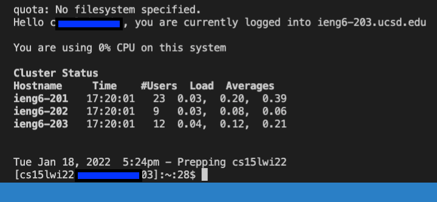
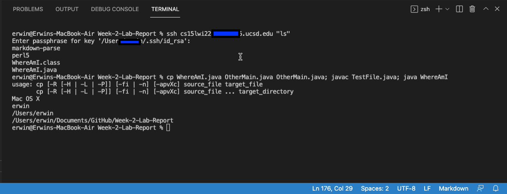
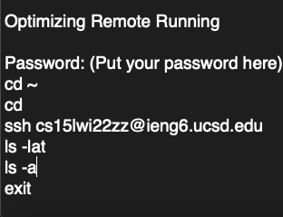

# **Logging Into a Course-Specific Account on ieng6 TUTORIAL**
*Created by: Erwin Madjus*

*Last Edited: January 18, 2022*

*Edits for Regrade: January 28, 2022*


**Purpose of this tutorial is to teach you how to do the following:**

* Installing VSCode
* Remotely Connecting
* Trying Some Commands
* Moving Files with ```scp```
* Setting an SSH Key
* Optimizing Remote Running


## **Installing VSCode**

In order to log into a course-specific account on ieng6, you should first download Visual Studio Code. You can download this IDE ("Integrated Development Environment") from the following link:

[Visual Studio Code Website (with Download Link)](https://code.visualstudio.com/)

Once you are on the website, click and install the software for your device, OSX for Macs or Windows for PCs. After installing VSCode, you can open the IDE and you should see the following:

 


## **Remotely Connecting**

Once you have finished installing VSCode, I will now teach you how to connect your personal device to a system located at your school or your place of work. 

If you are using a Windows computer, you first have to the following:

* Install OpenSSH from this link:  [How to Download OpenSSH](https://docs.microsoft.com/en-us/windows-server/administration/openssh/openssh_install_firstuse)

Once finished downloading the above for Windows or if you are using a Mac, you need to look for you course specific account for CSE15L from this link: 

* [https://sdacs.ucsd.edu/~icc/index.php](https://sdacs.ucsd.edu/~icc/index.php)

After getting your account, open VSCode and then do the following:

1. Click on Terminal, then select the New Terminal menu option
2. In the terminal, enter this command where ```zz``` is your unique code found from the account search up. 

```
$ ssh cs15lwi22zz@ieng6.ucsd.edu
``` 

3. If prompted if you are sure that you want to connect, select yes. 
4. Next, enter your password. 
5. You should now be connected to the computer located at your school or at your place of work. 





## **Trying Some Commands**

Now that you have connected your client device to the server, I will now talk about different commands that you can use. 

* ```cd ~``` 
changes directory to home directory
* ```cd ```
changes current directory

 

* ```ls -lat```
Displays the following: 


* ```ls -a```
lists (public and hidden) files or directories; It’s the all command where it doesn’t ignore entries starting with . 

 

* ```ls <directory>``` where ```<directory>``` is ```/home/linux/ieng6/cs15lwi22/cs15lwi22abc```, where 
the ```abc``` is one of the other group members’ username

* ```cp /home/linux/ieng6/cs15lwi22/public/hello.txt ~/```
We want to copy hello.txt into our home directory but since the file might be in a higher directory that we don’t have access to, permission’s denied.
* ```cat /home/linux/ieng6/cs15lwi22/public/hello.txt```
displays the following: we do not have access to this fie as well. 

This screenshot displays the outputs for the last 3 commands listed above:

 


* ```exit``` or Ctrl-D 
disconnect from the server

## **Moving Files with ```scp```**

In order to copy a file or files from your computer, that is not logged into ```ieng6```, to a remote computer, you will have to use the command ```scp```. 


For example, create the following under a file called ```WhereAmI.java```:

```
class WhereAmI {
  public static void main(String[] args) {
    System.out.println(System.getProperty("os.name"));
    System.out.println(System.getProperty("user.name"));
    System.out.println(System.getProperty("user.home"));
    System.out.println(System.getProperty("user.dir"));
  }
}
```

Run ```javac``` and ```java``` to see what this code displays in the terminal. 

After, run the following code in the terminal from the directory where you wrote the file, but instead of the following username, use your own:

```
scp WhereAmI.java cs15lwi22zz@ieng6.ucsd.edu:~/
```

Login using your password and after, you should now be able to see it in your home directory.  

After logging in, use ```ls``` and you should be able to see the file in your home directory. 

You are now able to run the code on the ```ieng6``` device using the commands ```javac``` and ```java``` 

 


## **Setting an SSH Key**

* To avoid having to always type your password everytime you login or use ```scp```, we can create an ```ssh``` Key. 
* You will have to use the command ```ssh-keygen``` where it generates 2 files, a public key, which is stored on the server, and a private key, which is stored on the client. 
* The ```ssh``` command can be used instead of always typing up your password.  

Run this on the terminal of you client computer: 


```

# on client (your computer)
$ ssh-keygen
Generating public/private rsa key pair.
Enter file in which to save the key (/Users/joe/.ssh/id_rsa): /Users/joe/.ssh/id_rsa
Enter passphrase (empty for no passphrase): 
Enter same passphrase again: 
Your identification has been saved in /Users/joe/.ssh/id_rsa.
Your public key has been saved in /Users/joe/.ssh/id_rsa.pub.
The key fingerprint is:
SHA256:jZaZH6fI8E2I1D35hnvGeBePQ4ELOf2Ge+G0XknoXp0 joe@Joes-Mac-mini.local
The key's randomart image is:
+---[RSA 3072]----+
|                 |
|       . . + .   |
|      . . B o .  |
|     . . B * +.. |
|      o S = *.B. |
|       = = O.*.*+|
|        + * *.BE+|
|           +.+.o |
|             ..  |
+----[SHA256]-----+

```

 


## **Optimizing Remote Running**

To Optimize Remote Running, in the case making a local edit on a java file on your computer, the client; and then copying it to the server and running it. 

 

Since you have already ```ssh``` into the server, you already have that command listed on your terminal that you can use. 

Inside of the terminal, first use the up arrow key until you find the ```ssh``` command that you used before. In my case it took 2 keystrokes. 

After that, I entered my passphrase which was 5 keystrokes. 

Next I used the up arrow key again which took 1 keystroke. 

Lastly I used the ```cp``` command that I have used earlier, which was used 2 keystrokes.


After making a local edit on the client, and then copying it to the server and running it, it took 10 Keystrokes. 


Having an effective workflow is essential to being productive when working in the industry. Some other things that you can do to enhance your workflow would be to do the following. 

1. Create a .txt file that contains all of the commands that you know you will be using a lot. (Writing down your ```ssh``` command and then copying takes 2 keystrokes)

2. Create an SSH Key so that you do not have to type your entire password everytime. (Creating an ```ssh``` key and writing it down on the terminal depends on how long you passphrase is)
3. Use semicolons to run multiple commands at one time. (Lessens the amount of keystrokes you are using)
4. Write a command in quotes after typing an SSH command to exit right after. (Lessens the amount of keystrokes you are using aswell)
5. Use the up-arrow (Lessens the amount of keystrokes you are using aswell) 

 
