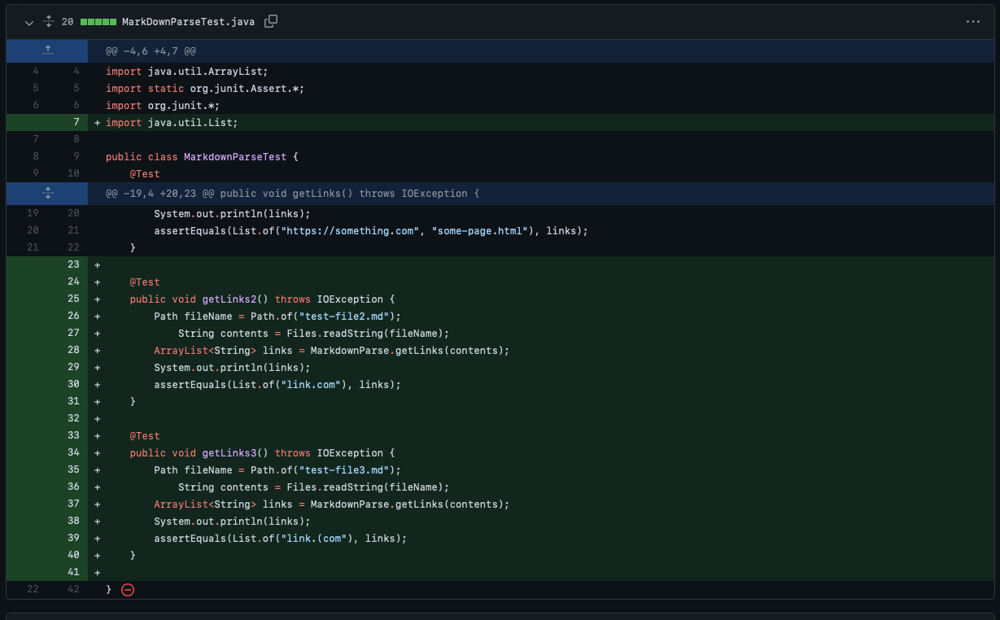
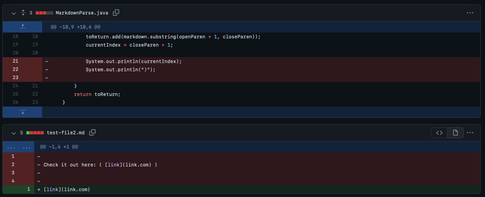

# **Week 4 Lab Report - Lab Report 2**

## Incremental Programming and Debugging
*Created by: Erwin Madjus*

*Last Edited: January 28, 2022*

## 3 Code Changes That Were Made During Labs 3 and 4: 

Before I start talking about the code changes that were made, these problems were found when working with the code from the following repository:

[Link to MarkdownParse Repository](https://github.com/erwinmadjus/markdown-parse)

**Problem #1 -** 

[Link to the Code Change Diff #1](https://github.com/erwinmadjus/markdown-parse/commit/7797b1e40dc25fbf8ec0a7e3ba720792f7461fd5)

 
 

[Link to Test-File2](https://github.com/erwinmadjus/markdown-parse/blob/main/test-file2.md)

**Problem #2-**

[Link to the Code Change Diff #2]()

 

**Problem #3-**

[Link to the Code Change Diff #3]()

  

