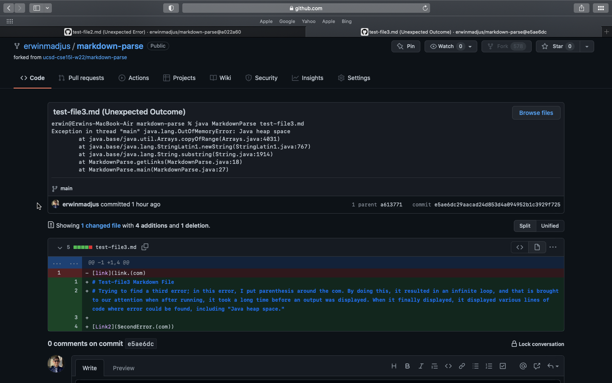
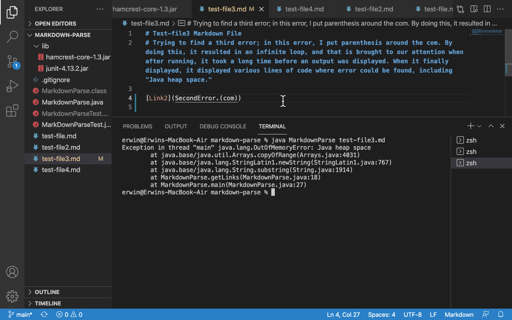
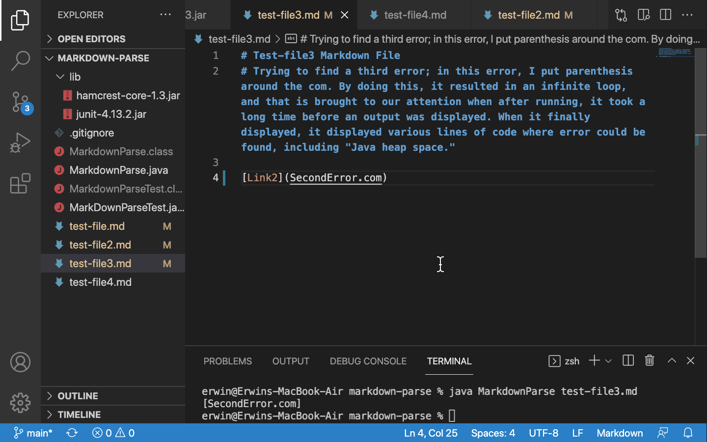
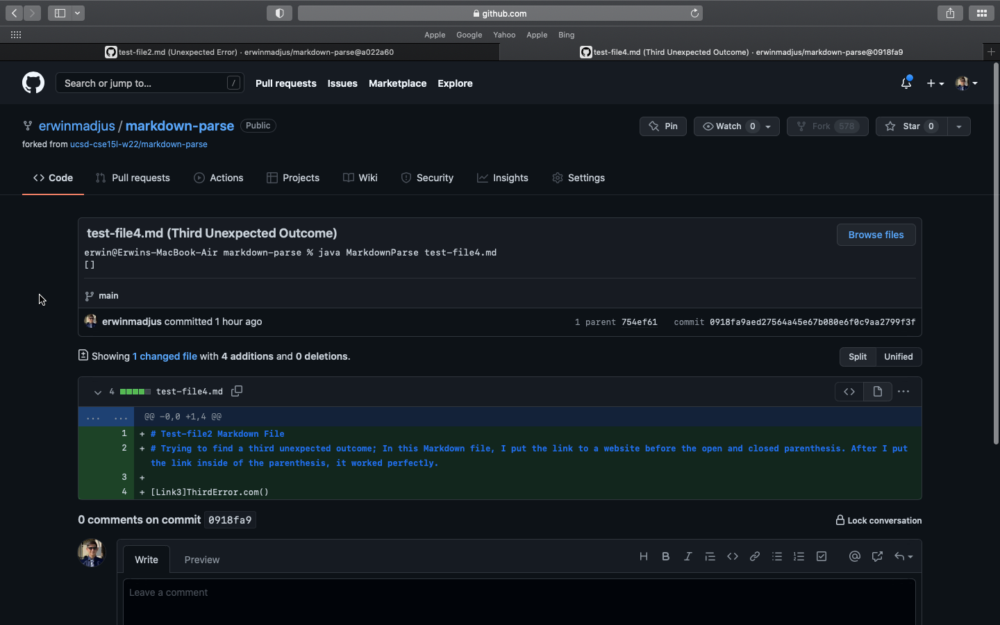
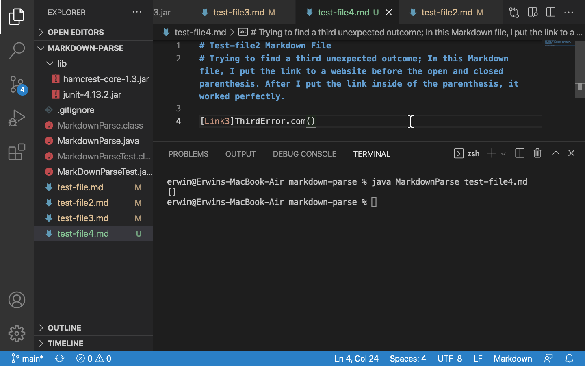
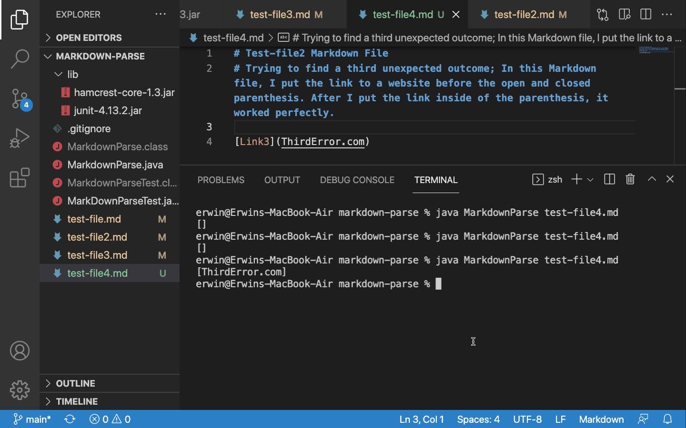

# **Week 4 Lab Report - Lab Report 2**

## Incremental Programming and Debugging
*Created by: Erwin Madjus*

*Last Edited: January 28, 2022*

## 3 Code Changes That Were Made During Labs 3 and 4: 

The link to all of the commits that I have made can be found if you click on the following link: 

[Link to MarkdownParse Repository Commits](https://github.com/erwinmadjus/markdown-parse/commits/main)

## **Problem #1 -** 

* Screenshot of the First Code Change Diff from GitHub: 

 

* Link to the test file for a failure-inducing input that prompted you to make that change. (First Unexpected Error)

[Link to the Code Change Diff #1](https://github.com/erwinmadjus/markdown-parse/commit/a022a604fd60cb653d4e29fe471fb8e5a918d2d1)

* The symptom of the **FIRST** failure-indcuing input. Shown by displaying the output of running ht efile at the command line where it was failing:  

```
Exception in thread "main" java.lang.StringIndexOutOfBoundsException: begin 0, end -1, length 225
        at java.base/java.lang.String.checkBoundsBeginEnd(String.java:3720)
        at java.base/java.lang.String.substring(String.java:1909)
        at MarkdownParse.getLinks(MarkdownParse.java:18)
        at MarkdownParse.main(MarkdownParse.java:27)
```

 

* Relationship: 

The bug was that instead of putting the link inside of ```()```, I put it inside of ```[]```, and this resulted in a failure-inducing input stating 

```Exception in thread "main" java.lang.StringIndexOutOfBoundsException: begin 0, end -1``` 

and led to the symptoms where the program could not read nor find the link that was in the markdown file and could not find the open parenthesis nor the closed parenthesis. To allow the program to display the expected outcome, I had to use the correct code needed to display a link. 

* After making a change to the Markdown File, here is the Expected Outcome"

```
[FirstError.com]
```

 


## **Problem #2-**

* Screenshot of the First Code Change Diff from GitHub: 

  

* Link to the test file for a failure-inducing input that prompted you to make that change. (Second Unexpected Error)

[Link to the Code Change Diff #2](https://github.com/erwinmadjus/markdown-parse/commit/2092412590b34f7bb0359098dc35f653d52e3569)

* The symptom of the **SECOND** failure-indcuing input. Shown by displaying the output of running ht efile at the command line where it was failing:  


```
erwin@Erwins-MacBook-Air markdown-parse % java MarkdownParse test-file3.md
Exception in thread "main" java.lang.OutOfMemoryError: Java heap space
        at java.base/java.util.Arrays.copyOfRange(Arrays.java:4031)
        at java.base/java.lang.StringLatin1.newString(StringLatin1.java:767)
        at java.base/java.lang.String.substring(String.java:1914)
        at MarkdownParse.getLinks(MarkdownParse.java:18)
        at MarkdownParse.main(MarkdownParse.java:27)
```



* After making a change to the Markdown File, here is the Expected Outcome"

```

[SecondError.com]

```

  


* Relationship: 

The bug was that I included too many open and closed parenthesis (```(``` and ```)``` ) and this resulted in a failure-inducing input stating ```OutOfMemoryError: Java heap space```. This then led to symptoms where the program was unable to find a closed parenthesis where it should be, for example, there was an open parenthesis before there was an expected closed parenthesis. To "fix" this symptom, I had to remove the extra parenthesis that were placed around the link.  


## **Problem #3-**

* Screenshot of the Third Code Change Diff:

 

* Link to the test file for a failure-inducing input that prompted you to make that change. (Third Unexpected Error)

[Link to the Code Change Diff #3](https://github.com/erwinmadjus/markdown-parse/commit/0918fa9aed27564a45e67b080e6f0c9aa2799f3f)

* The symptom of the **THIRD** failure-indcuing input. Shown by displaying the output of running ht efile at the command line where it was failing:  

```
erwin@Erwins-MacBook-Air markdown-parse % java MarkdownParse test-file4.md
[]
```

 

* After making a change to the Markdown File, here is the Expected Outcome"

```
erwin@Erwins-MacBook-Air markdown-parse % java MarkdownParse test-file4.md
[ThirdError.com]
```

  


* Relationship:  

The bug was that I did not put the link in the correct location, inside of the parenthesis ```()``` and this did not result in a failure-inducing input because the program didn't know what to state since there were no links in between the parenthesis. This then resulted in a symptom where the program had an output with brackets ```[]``` but had no link in between them. To "fix" this outcome, I just had to put the link in betweent the parenthesis. 


