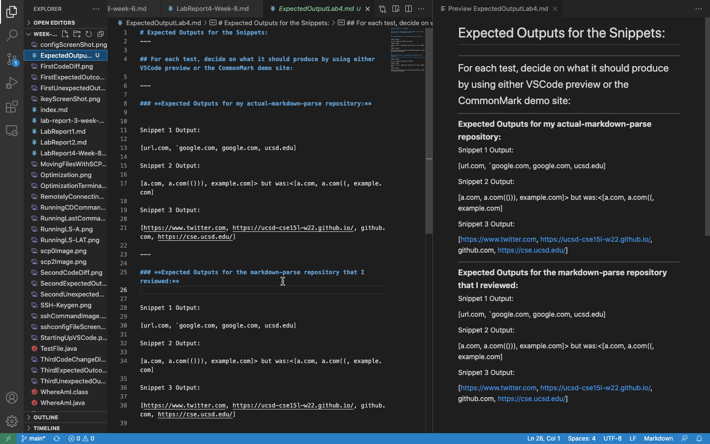
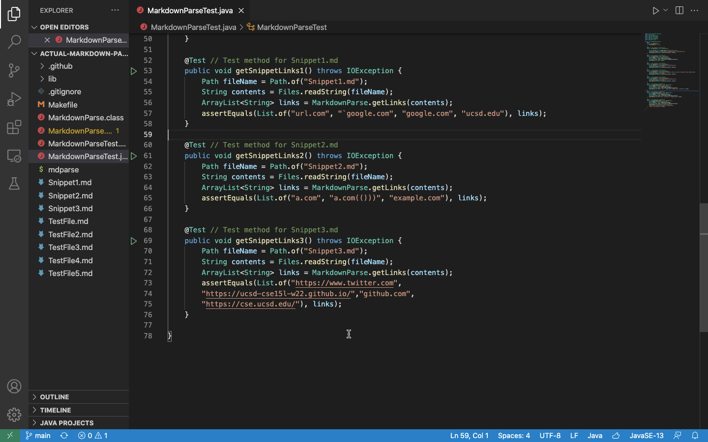
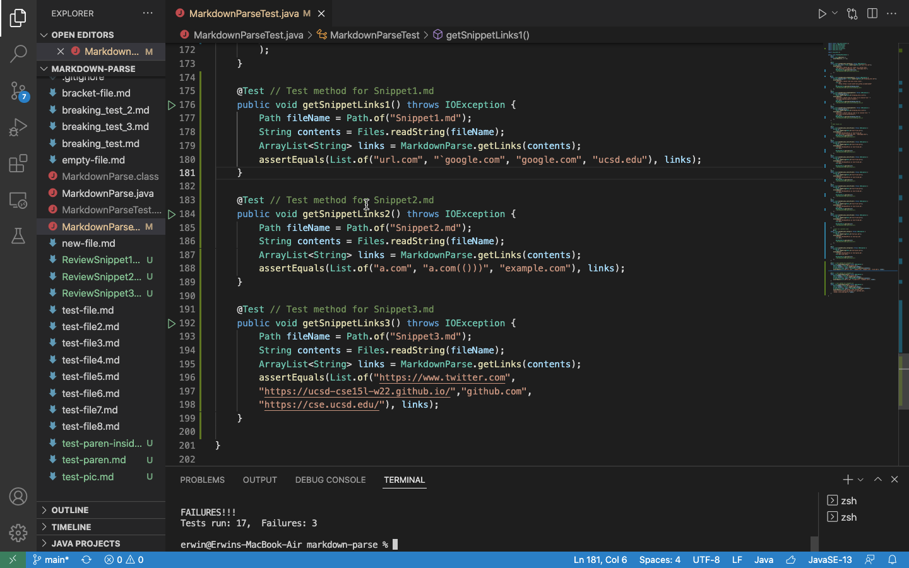
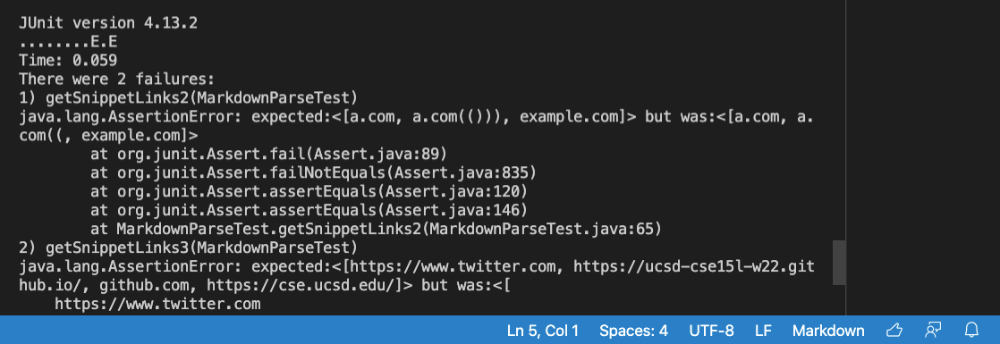
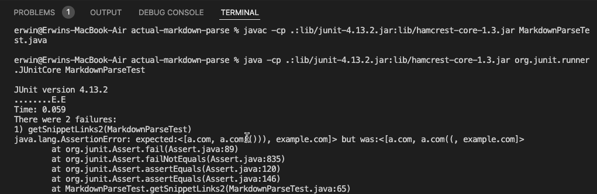
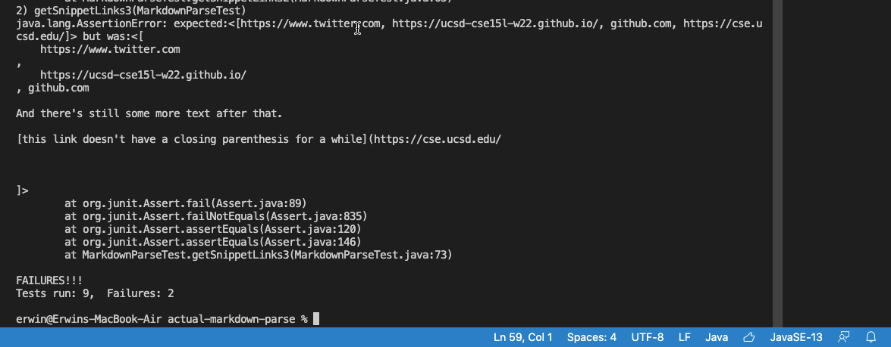
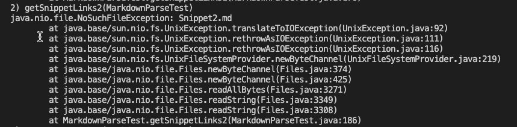
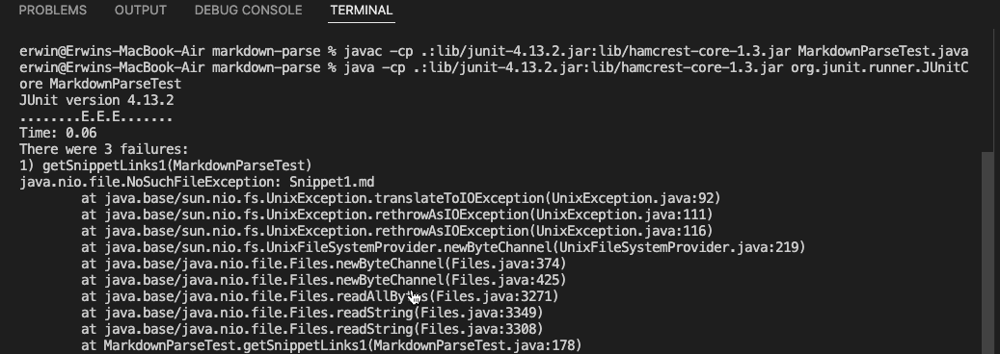
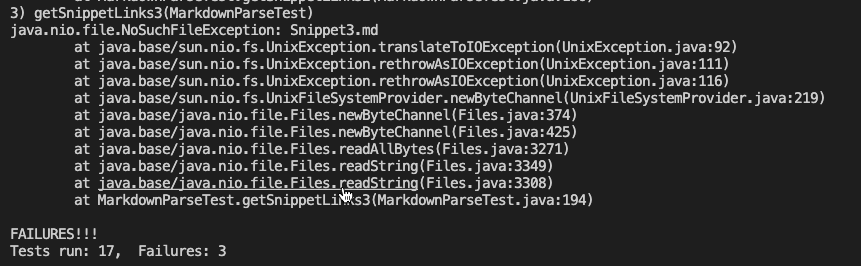

# **Week 8 Lab Report #4** 

*Created by: Erwin Madjus*

*Last Edited: February 25, 2022*
---

Link to my ```actual-markdown-parse``` Repository:

[My Repository](https://github.com/erwinmadjus/actual-markdown-parse)

Link to the ```Markdown-Parse``` repository that I reviewed in Week 7: 

[Repository That I Reviewed](https://github.com/yih365/markdown-parse/blob/main/MarkdownParse.java)

---

### For each test, decide on what it should produce by using either VSCode preview or the CommonMark demo site: 


##### **Expected Outputs for Both my ```actual-markdown-parse``` repository and the ```markdown-parse``` repository that I reviewed:**

Expected Outputs for all the Snippets are shown below:




---

## Code of the tests that are in the ```MarkdownParseTest.java``` of my ```actual-markdown-parse``` repository; 




---

## Code of the tests that are in the ```MarkdownParseTest.java``` of the ```markdown-parse``` repository that I reviewed; 




---
### **For your implementation, the corresponding output when running the tests; if it passed, say so. If it didn’t pass, show the specific part of the JUnit output that shows the test failure.**

# Answer:

Snippet 1: Yes, this test passed. 



Snippet 2: No, this test did not pass. 



Snippet 3: No, this test did not pass. 



---


### **For the implementation you reviewed in Week 7, the corresponding output when running the tests; if it passed, say so. If it didn’t pass, show the specific part of the JUnit output that shows the test failure.**

# Answer:

Snippet 1: No, this test did not pass. 



Snippet 2: No, this test did not pass. 



Snippet 3: No, this test did not pass. 



--- 

---

#### **Questions:**

1. Do you think there is a small (<10 lines) code change that will make your program work for snippet 1 and all related cases that use inline code with backticks? If yes, describe the code change. If not, describe why it would be a more involved change.


**Answer: Yes there is a small code change that will make the program work for Snippet 1 on the Repository that I reviewed and that involves creating a code that is similar to the code created to check to see if the link is an image link. To do that you would need to do the following:** 

```
if (nextOpenBracket != 0 && markdown.charAt(nextOpenBracket -1) == '`'){   
                currentIndex = nextOpenBracket+1;  
                continue;   
            }
```

**By checking to see if there is a backtick before the first open bracket, you can create a code that will allow the program to output the link despite having that backtick.**

2. Do you think there is a small (<10 lines) code change that will make your program work for snippet 2 and all related cases that nest parentheses, brackets, and escaped brackets? If yes, describe the code change. If not, describe why it would be a more involved change.

**No, there is not a small code change that I can make to make the program work for Snippet 2 because I would have to create an entirely new method that involves finding all of the open parenthesis in the code before finding all of the close parenthesis that correspond with each open parenthesis. First I would create a new variable like ```int openParenCount```, I would have to create a code called ```findCloseParen``` that first has to find the first parenthesis in the markdown file, and in the while loop for this code I would have to loop through all the characters of the actual link before the next open parenthesis is found. This could be done in the following way:**


```
static int findCloseParen(String markdown, int openParen) {
    int closeParen = openParen + 1;
    int openParenCount = 1;
    while (openParenCount > 0 && closeParen < markdown.length()) {
        if (markdown.charAt(closeParen) == "(") {
            openParenCount++;
        } else if (markdown.charAt(closeParen) == ")" {
            openParenCount--;
        }
        closeParen++;
    }
    if (openParenCount == 0) { return closeParen - 1; }
    else {return - 1; }
}

```

**This alone does not fix the program when it runs, you have to debug the program using JDB and that leads to more errors that you have to fix and create a code that fixes the issue of nested parenthesis inside the link.**


3. Do you think there is a small (<10 lines) code change that will make your program work for snippet 3 and all related cases that have newlines in brackets and parentheses? If yes, describe the code change. If not, describe why it would be a more involved change. 

**No, there is not small code change that will make the program work for Snippet 3 because looking at the output the code changes that I already have fixes the first half of the snippet, but as that code is ran, it seems to not be able to run through again to fix the same issues found at the end of the snippet. I created a code change that fixes words in between the closed bracket and the first open parenthesis but that does not loop in the case where there are more words found in the links at the end. I would need to code a method that stops the program from collecting the characters that are not a part of the actual link that needs to be displayed, I also need to create a loop that prevents the characters in the brackets to be displayed in the latter part of the snippet, and lastly I need to create a code change that stops the program from outputting all the spaces that are in place before the last close parenthesis.**


---


### **Background Information:** 

This lab will involve working with the following 3 markdown snippets: 


```
`[a link`](url.com)

[another link](`google.com)`

[`cod[e`](google.com)

[`code]`](ucsd.edu)
```

 
```
[a [nested link](a.com)](b.com)

[a nested parenthesized url](a.com(()))

[some escaped \[ brackets \]](example.com)

```

 
```
[this title text is really long and takes up more than 
one line

and has some line breaks](
    https://www.twitter.com
)

[this title text is really long and takes up more than 
one line](
    https://ucsd-cse15l-w22.github.io/
)


[this link doesn't have a closing parenthesis](github.com

And there's still some more text after that.

[this link doesn't have a closing parenthesis for a while](https://cse.ucsd.edu/


)

And then there's more text

```


If you’re using a direct clone to ```ieng6```, you might find it useful to give an extra argument to ```git clone``` that specifies which directory to clone into, for example:


```
$ git clone https://github.com/ucsd-cse15l-w22/markdown-parse markdown-parse-target-directory
```

--- 
