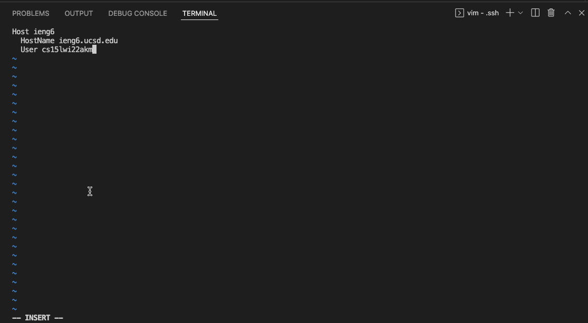

# **Streamline ```ssh``` Configuration Tutorial**

*Created by: Erwin Madjus*

*Last Edited: February 10, 2022*

---
Group Choice 1 - Streamline ```ssh``` Configuration: 

--- 

#### Background Information:

As we all know, when we ```ssh``` into a server, in my case, the server at UCSD, we have to ```ssh``` using the following information: 

```$ ssh cs15lwi22zzz@ieng6.usd.edu``` where the ```zzz``` is the users unique code. 

Memorizing this shouldn't really be a problem, but it can be quite tedious, having to always type in this command whenever you are trying to log into a server whenever you have to get work done. This is a way to prevent this, essentially optimizing your workflow. 

That will be discussed below!

---

## Streamlining ```ssh``` Configuration 

### Show your ```.ssh/config``` file, and how you edited it (with VSCode, another program, ect). 

In order to access the ```.ssh/config```, you will have to open a new terminal and type in the following command: 

```
cd
```

Next, type this:

```
cd .ssh
```

Next, type this:

```
ls
```

You should see the following:

```
config          id_rsa          id_rsa.pub      known_hosts
```

Next, type this:

```
vi config
``` 

After entering that command in the terminal, it should take you to the ```.ssh/config``` file. 


In the ```.ssh/config``` file, you should enter the following by pressing the key ```i``` and typing the following code:


```
Host ieng6 
    HostName ieng6.ucsd.edu
    User cs15lwi22zzz (use your username)
```

After doing this, move onto the next section which is below this one. 



After entering those lines of code, exit the file by clicking ```esc``` followed by pressing ```:```, ```wq```. 


Disclaimer: if you run into a problem, change the code written inside of the ```.ssh/config``` file to the following:

```
Host ieng6 
    HostName ieng6.ucsd.edu
    User cs15lwi22zzz (use your username)
    IdentityFile ~/.ssh/id_rsa_ucsd
```

### Show the ```ssh``` command logging you into your account using just the alias you chose.

After you setup the ```.ssh/config``` file, you can exit the terminal by following the last few steps in the section above. Afterwards, you can type the following command: 

```ssh ieng6```

Afterwards, type the following command in the terminal:

```
ssh ieng6
```

I ```ssh``` into ```ieng6``` because that is the alias that I chose. 


### Show an ```scp``` command copying a file to your account using just the alias you chose.  

Open a new terminal and enter the following command:

```cd .ssh```


Next enter the following command:

```
scp test.txt ieng:/home/linux/ieng6/cs15lwi22/cs15lwi22akm/test
```

Next enter this:

```
cd test
```

Lastly, check to see if you successfuly copied a file into your account by using this command:

```ls```

